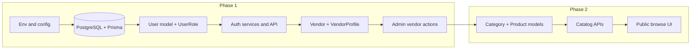

# Phase 1 implementation plan

This is the **consolidated, MVP-aligned implementation plan** for BazaarLink. It merges guidance from `docs/product/`, `docs/flows/`, `docs/business/`, `docs/database/`, `docs/architecture/`, `docs/roadmap.md`, and this folder.

---

## How “Phase 1” is defined here

| Source | What it says |
|--------|----------------|
| `docs/roadmap.md` | **Phase 1 = authentication + vendor onboarding** (not catalog, cart, checkout, or orders). |
| `docs/product/mvp-scope.md` | Lists the **full MVP surface** to ship before “later features” (includes catalog through payment and dashboards). That is the **product MVP**, delivered across **multiple roadmap phases**. |
| Earlier draft of this file | Described a larger “Phase 1” (including catalog and a full MVP schema). |

**Interpretation used in this document (clearest, implementation-ready):** **Phase 1 means `docs/roadmap.md` Phase 1 only**—identity, sessions, roles, and vendor onboarding through admin approve/suspend. Catalog and everything after it follow **roadmap Phases 2–4** (and polish in Phase 5). The **full MVP schema** remains the north star in `docs/database/schema-detailed.md` and `docs/database/enums.md`; **migrations and APIs are introduced incrementally** so Phase 1 does not build unused order/payment surfaces.

**Assumptions (brief):**

- **Single role per user** and **at most one `Vendor` per user** (`docs/architecture/open-decisions.md`, `docs/database/enums.md`).
- **Wishlist is post-MVP** (`docs/architecture/open-decisions.md`); omit from Prisma/API/UI until explicitly in scope.
- **`emailVerified` exists on `User`**; **vendor registration is blocked until verified**; checkout will be blocked later the same way (`docs/architecture/open-decisions.md`). Password reset is part of the **auth** feature set in `docs/product/core-features.md`—ship in Phase 1 if time permits, otherwise immediately before any paid flow (roadmap Phase 4).

---

## Scope (Phase 1 — ship first)

Aligned with `docs/roadmap.md` Phase 1 and `docs/flows/vendor-onboarding-flow.md`.

1. **Authentication (customer-capable baseline)**  
   - Signup and login (`docs/product/core-features.md`, `docs/product/mvp-scope.md`).  
   - Session handling and protected routes (stack per `docs/architecture/system-design.md`: Next.js, API routes, service layer).  
   - **Role model:** `CUSTOMER`, `VENDOR`, `ADMIN` on `User` (`docs/product/users-and-roles.md`, `docs/database/enums.md`).  
   - **Email verification:** persist `emailVerified`; enforce **before vendor onboarding submission** (`docs/architecture/open-decisions.md`, `docs/database/schema-detailed.md`).  
   - **Password reset:** implement per `docs/product/core-features.md` (same milestone as login if possible).

2. **Vendor onboarding**  
   - Flow: signup → business profile → document upload → admin review → approved seller can list products **in a later phase** (`docs/flows/vendor-onboarding-flow.md`).  
   - **Vendor + `VendorProfile`:** business name, contact fields, **`documentUrl`** (storage integration can be minimal at first—URL or stub—**but treat as private; admin-only read** per `docs/architecture/edge-cases.md` / phase-plan risk themes).  
   - **`Vendor.status`:** `PENDING` → `APPROVED` / `SUSPENDED` (`docs/database/enums.md`, `docs/business/marketplace-rules.md`).  
   - **Admin:** list pending vendors, approve, suspend (`docs/product/users-and-roles.md`).

3. **Minimal UX**  
   - Pages/flows that let a user sign up, log in, complete seller application, and let an admin act on the queue (see [Frontend](#frontend-pages-and-components-to-build-first)).  
   - No requirement for polished “dashboards” in Phase 1 beyond what’s needed for onboarding and admin actions (`docs/roadmap.md` Phase 5 covers polish).

---

## Out of scope (Phase 1)

Explicitly **not** part of Phase 1; they appear in later roadmap phases or post-MVP product lists:

| Area | Why / where |
|------|----------------|
| **Categories & product catalog (CRUD, public browse, product detail)** | `docs/roadmap.md` Phase 2; `docs/product/mvp-scope.md` “product listing/browsing” applies to MVP as a whole, not Phase 1. |
| **Search, filters, sorting** | `docs/product/core-features.md` — defer with catalog (Phase 2+). |
| **Cart & checkout** | `docs/roadmap.md` Phases 3–4; `docs/flows/checkout-flow.md`. |
| **Orders, payments, Stripe, webhooks** | `docs/roadmap.md` Phase 4; `docs/flows/order-flow.md`; `docs/architecture/system-design.md`. |
| **Commissions, payouts, refunds (business logic + APIs)** | MVP needs them later (`docs/business/*`, `docs/database/schema-detailed.md`); **no Phase 1 API** unless stubbing for future schema. |
| **Reviews** | `docs/product/core-features.md` / `docs/database/entities.md` — after purchasable flows exist. |
| **Notifications, analytics, coupons, chat, delivery integrations, mobile app** | `docs/product/mvp-scope.md` “Later features” and `docs/roadmap.md` Phase 6. |
| **Wishlist** | `docs/architecture/open-decisions.md` — post-MVP. |

Phase 1 **may** add nullable FKs or enum placeholders in Prisma only if the team prefers one early migration; **prefer adding tables when the first route that needs them ships** to avoid dead schema and security review overhead.

---

## Prisma models to implement first

Order = **dependency order**. **Phase 1 completes when the first row is done.**

| Priority | Model(s) | Phase (roadmap) | Notes |
|----------|-----------|-----------------|--------|
| 1 | `User` | 1 | `role`, `passwordHash`, `emailVerified`, unique `email` (`docs/database/schema-detailed.md`). |
| 2 | `Vendor` | 1 | Unique `userId`; `status`, `approvedAt`, `approvedBy` (`docs/database/schema-detailed.md`). |
| 3 | `VendorProfile` | 1 | Unique `vendorId`; `businessName`, `documentUrl`, contacts (`docs/database/schema-detailed.md`). |
| 4 | `Category` | 2 | Tree via `parentId`; unique `slug` (`docs/database/schema-detailed.md`, `docs/roadmap.md` Phase 2). |
| 5 | `Product` | 2 | `vendorId`, `categoryId`, `slug`, `status`; unique `(vendorId, slug)` (`docs/business/marketplace-rules.md`, `docs/database/schema-detailed.md`). |
| 6 | `ProductImage`, `ProductVariant` | 2 | Images + SKU/price/stock (`docs/product/core-features.md`, `docs/database/schema-detailed.md`). |
| 7 | `Address` | 3 | User shipping addresses (`docs/flows/checkout-flow.md`, `docs/database/schema-detailed.md`). **Immutable use for placed orders** per `docs/architecture/open-decisions.md`. |
| 8 | `Cart`, `CartItem` | 3 | One cart per user; line = variant + qty (`docs/database/schema-detailed.md`, `docs/product/core-features.md`). |
| 9 | `Order`, `OrderItem` | 4 | `OrderItem.vendorId` for per-vendor split (`docs/business/marketplace-rules.md`, `docs/flows/order-flow.md`). |
| 10 | `Payment`, `Refund` | 4 | Provider `externalId`; refund links (`docs/database/schema-detailed.md`, `docs/architecture/edge-cases.md`). |
| 11 | `Commission`, `Payout` | 4+ | After orders/payments exist (`docs/business/commission-rules.md`, `docs/database/schema-detailed.md`). |
| 12 | `Review` | After purchase flow | `docs/product/core-features.md`; unique `(productId, userId)` per `docs/database/schema-detailed.md`. |

**Full MVP entity list** (including post-MVP wishlist): `docs/database/entities.md` — **exclude Wishlist** from MVP implementation (`docs/architecture/open-decisions.md`).

---

## Enums to implement first

Add enums **when the first model that references them is migrated** (keeps Prisma and TS in sync without unused values).

| Priority | Enum | Introduced with | Values (MVP) |
|----------|------|-----------------|--------------|
| 1 | `UserRole` | `User` | `CUSTOMER`, `VENDOR`, `ADMIN` (`docs/database/enums.md`). |
| 2 | `VendorStatus` | `Vendor` | `PENDING`, `APPROVED`, `SUSPENDED` (`docs/database/enums.md`, `docs/business/marketplace-rules.md`). |
| 3 | `ProductStatus` | `Product` | `DRAFT`, `ACTIVE` (`docs/database/enums.md`). |
| 4 | `OrderStatus` | `Order` | `PENDING`, `PAID`, `PROCESSING`, `SHIPPED`, `DELIVERED`, `CANCELLED` (`docs/database/enums.md`, `docs/flows/order-flow.md`). |
| 5 | `OrderItemStatus` | `OrderItem` | `PENDING`, `CONFIRMED`, `SHIPPED`, `DELIVERED`, `CANCELLED`, `REFUNDED` (`docs/database/enums.md`, `docs/business/marketplace-rules.md`). |
| 6 | `PaymentStatus` | `Payment` | `PENDING`, `SUCCEEDED`, `FAILED`, `REFUNDED` (`docs/database/enums.md`). |
| 7 | `RefundStatus` | `Refund` | `REQUESTED`, `APPROVED`, `REJECTED`, `COMPLETED` (`docs/database/enums.md`, `docs/business/refund-policy.md`). |
| 8 | `PayoutStatus` | `Payout` | `PENDING`, `PROCESSED`, `FAILED` (`docs/database/enums.md`). |

---

## API routes and services to build first

Use **plain functions** per domain in a service layer (`docs/architecture/system-design.md`); boundaries in `docs/architecture/services.md`. Suggested route grouping (names can match Next.js `app/api/...`):

### Phase 1 (roadmap)

| Order | Area | Routes / behaviors | Service module |
|-------|------|-------------------|----------------|
| 1 | Auth | Signup, login, logout, current user, email verification trigger/confirm, password reset | `auth` |
| 2 | Vendor (self) | Register as seller, read/update own `Vendor` + `VendorProfile`, set `documentUrl` (upload pipeline or presigned URL as needed) | `vendor` |
| 3 | Admin | List vendors (filter `PENDING`), approve, suspend | `admin` (or `vendor` + admin guard) |

**Authorization rules to enforce in Phase 1:**

- Only **`ADMIN`** calls approve/suspend (`docs/product/users-and-roles.md`).  
- Only **`VENDOR`** with own `Vendor` row manages that profile; **`PENDING`/`SUSPENDED`** cannot perform selling actions that don’t exist yet—but **already block any premature “activate catalog” endpoints** when you add them (`docs/architecture/edge-cases.md`).  
- **`documentUrl`**: never returned to non-admin clients (`docs/architecture/edge-cases.md`).

### Phase 2+ (reference ordering only)

| Phase | Area | Purpose |
|-------|------|---------|
| 2 | Categories | Admin CRUD; public list/get by slug (`docs/product/users-and-roles.md`, `docs/roadmap.md` Phase 2). |
| 2 | Products | Vendor CRUD (scoped); public list/detail for `ACTIVE` + approved vendor (`docs/business/marketplace-rules.md`). |
| 3 | Cart | Customer cart CRUD (`docs/product/core-features.md`). |
| 3–4 | Checkout / orders / payments | Align with `docs/flows/checkout-flow.md`, `docs/flows/order-flow.md`; idempotency per `docs/architecture/edge-cases.md`. |

---

## Frontend pages and components to build first

Stack: **Next.js (App Router) + TypeScript** (`docs/architecture/system-design.md`). Group routes with route groups as needed (auth vs admin).

### Phase 1

| Priority | Page / flow | Role | Notes |
|----------|-------------|------|--------|
| 1 | Sign up / Log in | All | Match `docs/product/core-features.md`. |
| 2 | Email verification UI | All | Required before seller application (`docs/architecture/open-decisions.md`). |
| 3 | Password reset UI | All | Same doc as above. |
| 4 | “Become a seller” / onboarding | `CUSTOMER` → `VENDOR` (or signup as vendor—pick one UX; schema assumes `User.role` + `Vendor` row) | Mirrors `docs/flows/vendor-onboarding-flow.md`. |
| 5 | Seller status (pending / approved / suspended) | `VENDOR` | Minimal read-only or light edit for profile until Phase 5 polish (`docs/roadmap.md`). |
| 6 | Admin vendor queue (list, approve, suspend) | `ADMIN` | `docs/product/users-and-roles.md`. |

**Reusable components (Phase 1):** forms (auth, profile), layout with session-aware nav, role guard / middleware, status badges for `VendorStatus`, basic error and loading states.

### Phase 2+ (reference only)

Public home/browse, product detail, category navigation, vendor product management UI, then cart/checkout (Phases 3–4) per `docs/roadmap.md` and `docs/product/mvp-scope.md`.

---

## Dependencies and ordering

**Suggested sequence:**

1. **Project baseline:** Next.js, TypeScript, Prisma, PostgreSQL, env secrets (`docs/architecture/system-design.md`).  
2. **Migration 1:** `User` + `UserRole` (+ `emailVerified`).  
3. **Auth:** hashing, session/JWT/cookies, middleware, auth API routes, login/signup UI.  
4. **Email verification + password reset** (policy in `docs/architecture/open-decisions.md` / `docs/product/core-features.md`).  
5. **Migration 2:** `Vendor`, `VendorProfile`, `VendorStatus`.  
6. **Vendor onboarding APIs + UI**; enforce verification before submit.  
7. **Admin APIs + UI** for approve/suspend.  
8. **Phase 2:** categories and products (models, services, routes, public/vendor UI)—only after Phase 1 is done; **`ACTIVE` products only if `Vendor.status === APPROVED`** (`docs/business/marketplace-rules.md`).  
9. **Phase 3–4:** addresses, cart, checkout, orders, payments—follow `docs/flows/*` and `docs/architecture/edge-cases.md` (stock, idempotency, payment-then-order failure).

---

## Major risks during implementation

| Risk | Mitigation |
|------|------------|
| **Doc vs roadmap mismatch** (catalog in old Phase 1 draft) | Treat **roadmap Phase 1** as the shipping boundary for this milestone; add catalog only in Phase 2 (`docs/roadmap.md`). |
| **Leaking `documentUrl` or PII** | Admin-only access; no public or vendor-peer exposure (`docs/architecture/edge-cases.md`). |
| **`PENDING` / `SUSPENDED` vendor access** | Centralize guards for any future “sell” or `ACTIVE` transitions (`docs/business/marketplace-rules.md`, `docs/architecture/edge-cases.md`). |
| **Email verification drift** | Enforce gate at **vendor application** and later **checkout** (`docs/architecture/open-decisions.md`). |
| **Payment success / order write split** (later phases) | Transactional or idempotent reconciliation (`docs/architecture/edge-cases.md`, `docs/flows/order-flow.md`). |
| **Concurrent stock / checkout** | Re-validate at payment; locking or reservation strategy (`docs/architecture/edge-cases.md`). |
| **Refund / commission / payout correctness** (later) | Idempotent refunds; clawback/next-payout rules (`docs/architecture/open-decisions.md`, `docs/business/commission-rules.md`, `docs/business/refund-policy.md`). |
| **Suspended vendor listings** | Hide or block checkout on their products; don’t auto-cancel in-flight orders (`docs/architecture/open-decisions.md`). |
| **Order split mistakes** | Every `OrderItem` carries correct `vendorId` (`docs/business/marketplace-rules.md`, `docs/database/schema-detailed.md`). |

---

## Related documentation

| Topic | Doc |
|-------|-----|
| MVP product breadth | `docs/product/mvp-scope.md`, `docs/product/core-features.md` |
| Phased delivery | `docs/roadmap.md` |
| Tables & fields | `docs/database/schema-detailed.md`, `docs/database/entities.md`, `docs/database/schema-notes.md` |
| Enums | `docs/database/enums.md` |
| Resolved product/architecture choices | `docs/architecture/open-decisions.md` |
| Failure modes | `docs/architecture/edge-cases.md` |
| Flows | `docs/flows/vendor-onboarding-flow.md`, `docs/flows/checkout-flow.md`, `docs/flows/order-flow.md` |
